# How to use the platform ?

Start by going to the following address [localhost:4200](localhost:4200).

Once on the platform you should have a page that looks like this one.

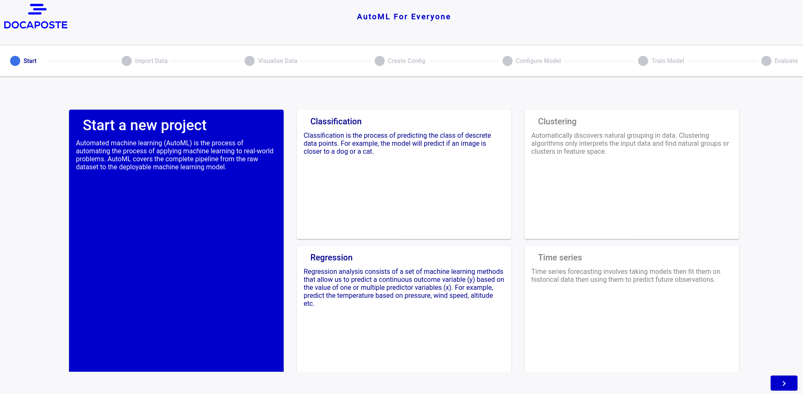

To start a new project click on the button arrow at the bottom right, as below.

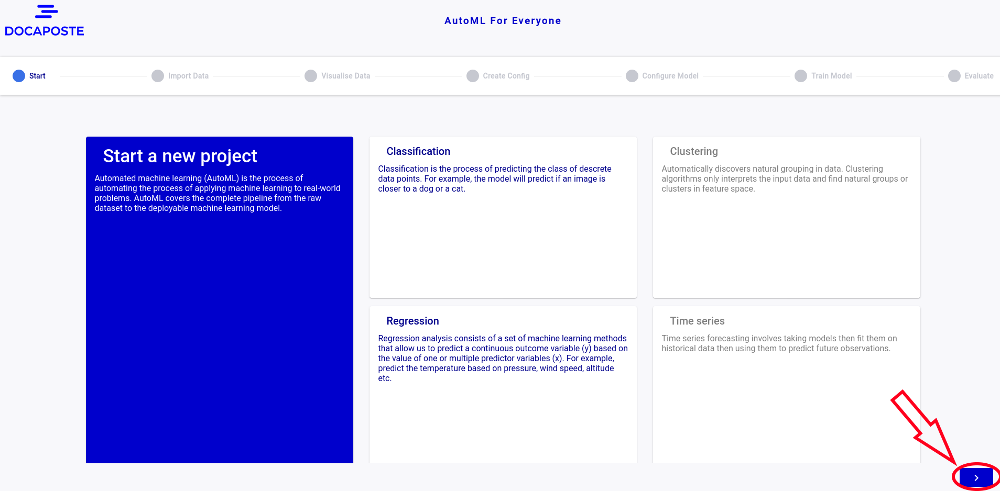

 

# 1 - Import Data

On the next page you can upload a dataset or use an existing one.

To upload a dataset first click on "Import data" then on the browse button.

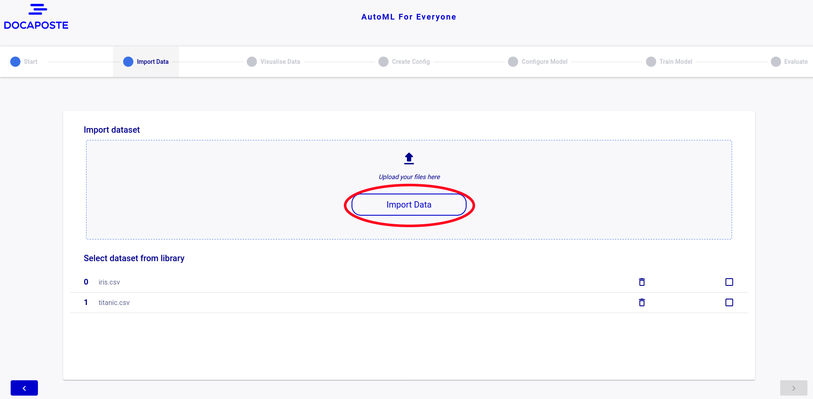

Once the dataset is upload, check the box next to the dataset you want to study then click on the button at the bottom right.

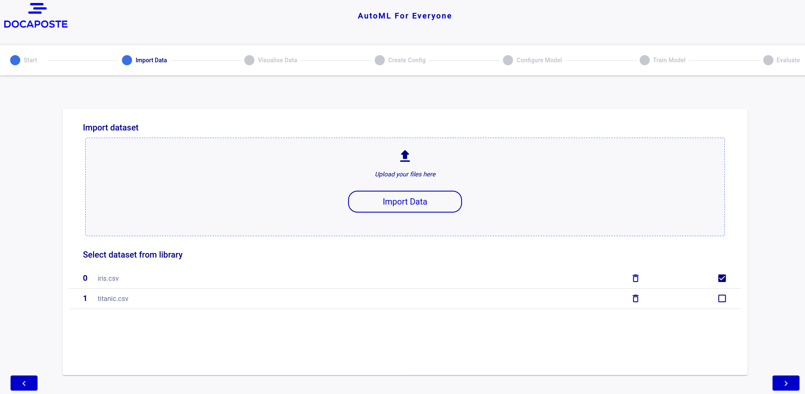

You can also delete a dataset by clicking on the trash can icon.

 

# 2 - Visualize data

On the "Visualize data" page you can view several graphs representing your data, thanks to Sweetviz.

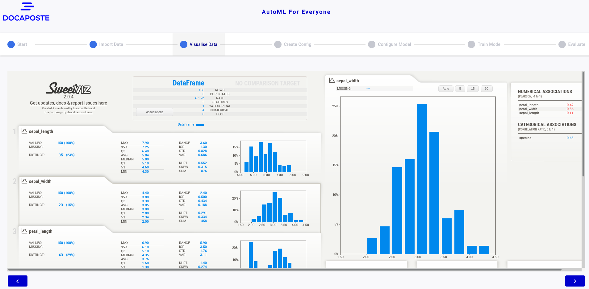

 

# 3 - Create Config

Now that you are on this page you will be able to create a new configuration or use an existing one. This configuration will allow you to define the target column of your dataset and choose which column will be taken into account or not.

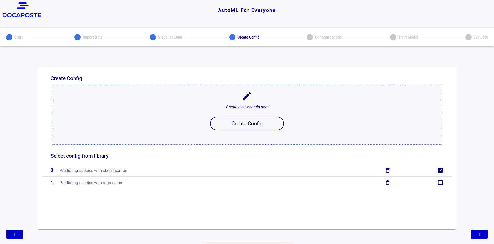

To create a new configuration you will have to click on the "Create Config" button.

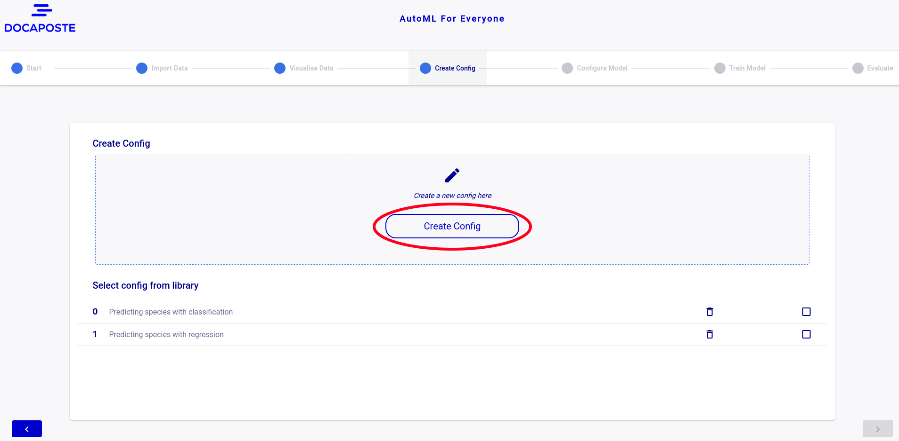

You will then have access to a small window in the middle of your screen where you can choose between classification or regression.
You will need to specify which column will be parsed in the "Enabled" column, you will also need to select a target column in the "Label" column.

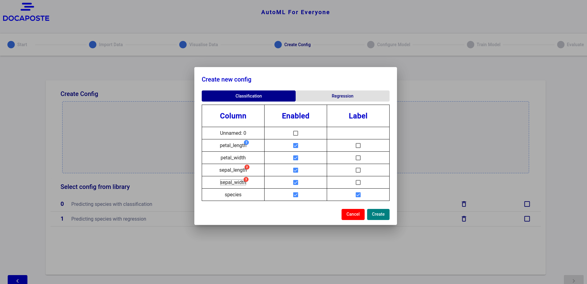

Then you can select a configuration to proceed to the next step or delete a configuration if you no longer use it.

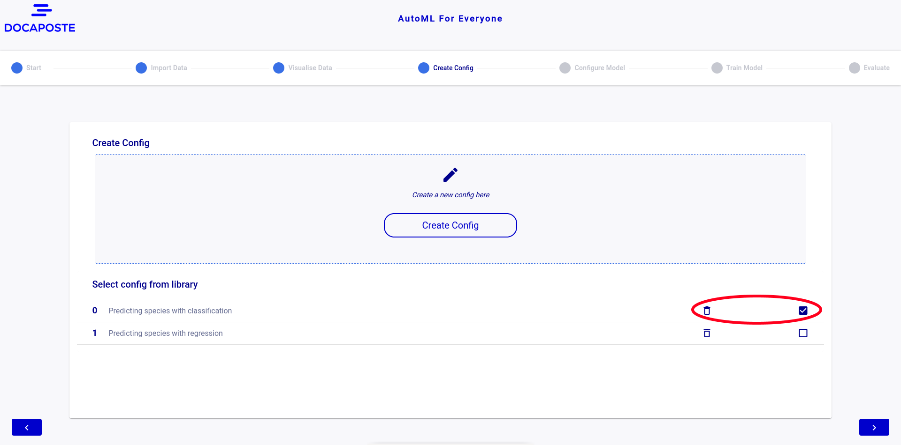

 

# 4 - Configure Model

Now that you are on this page you will be able to create a new model or use an existing one.
The model will allow you to configure several parameters in order to have a little more control for experienced users.

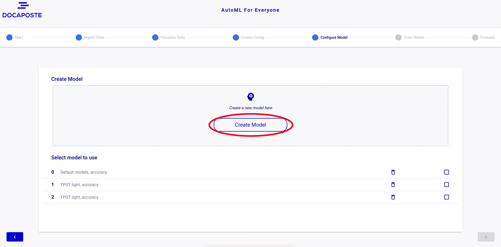

You will then have access to a small window in the middle of your screen where you can modified some parameters if you wand to try some custom models.
But if you are not experienced enough in the field, you can also leave the default settings.

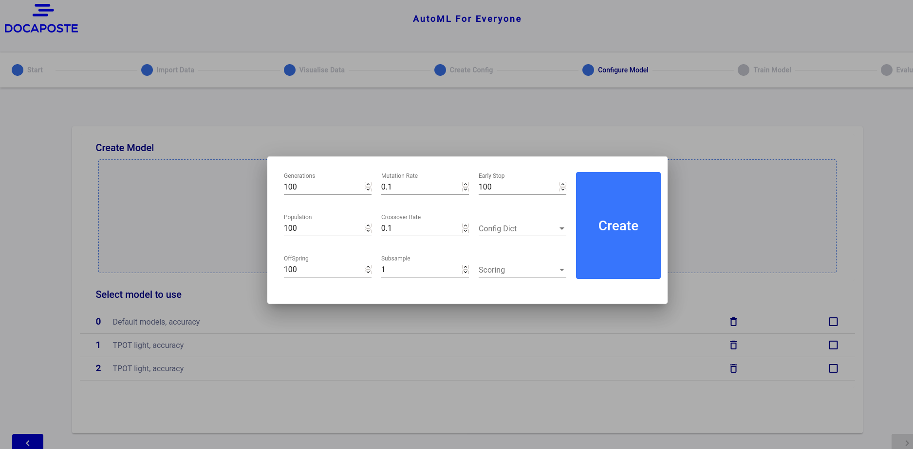

Then you can select a model to proceed to the next step or delete a model if you no longer use it or if the accuracy is too low.

 

# 5 - Train Model

Once you are on the model training page you will have to click on the "Launch Training" button to start the training.

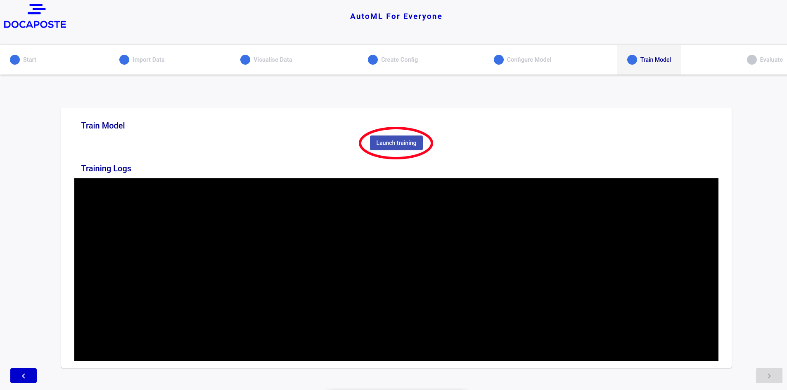

When the sentence "Model has done training" appears, you can go to the next page by clicking on the button at the bottom right.

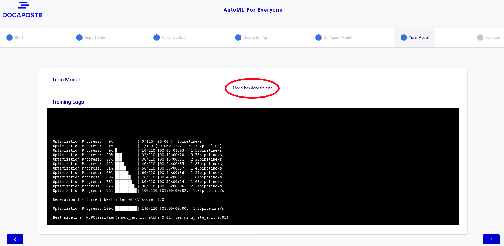

 

# 6 - Evaluate

Once on the "Evaluate" page you will find a confusion matrix as well as another graph allowing you to see the incidence rate of each parameter on the result.

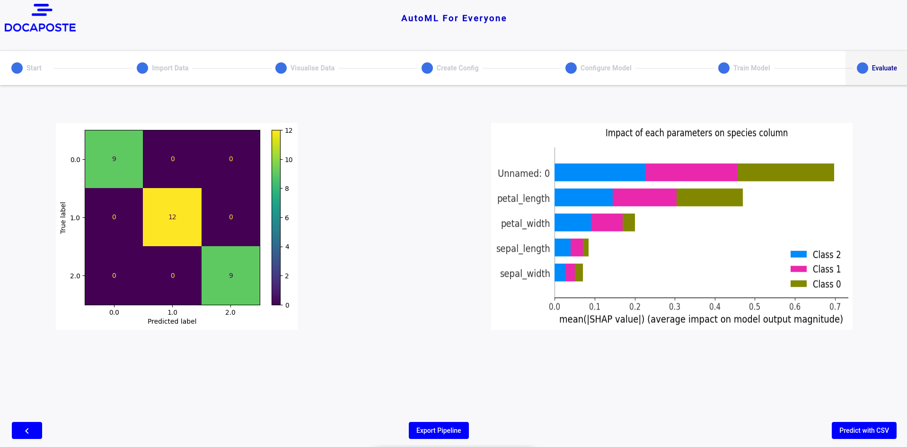

On this page you can also find two buttons, "Export Pipeline" which will allow you to retrieve a pipeline using python using the model you trained previously.
Predict with CSV" which will allow you to make predictions about values in a csv.

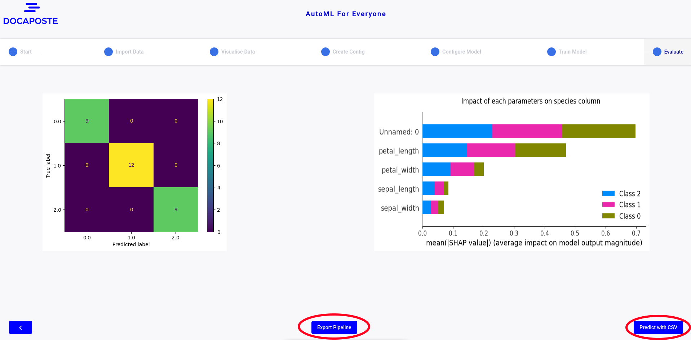
