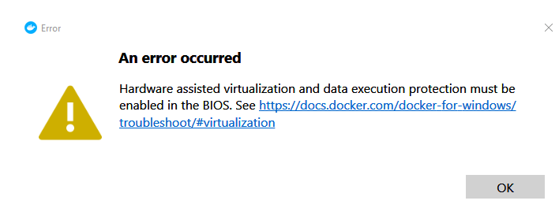

# Installation Guide

If you encounter a problem similar to the screenshot below, check that virtualization is enabled in the bios.

Follow these instructions : 

1. In the case the problem persists, start a powershell as administrator.
2. Run bcdedit /set hypervisorlaunchtype auto
3. Restart your computer

#

If you encounter a problem with WSL2, follow the step 4 of this [link](https://docs.microsoft.com/fr-fr/windows/wsl/install-win10#step-4---download-the-linux-kernel-update-package)